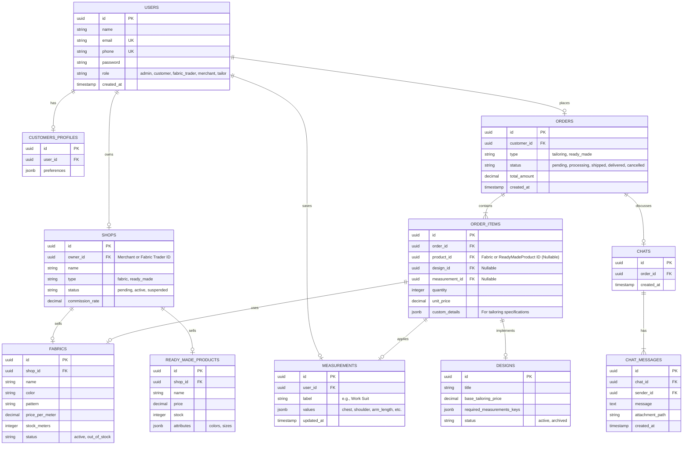
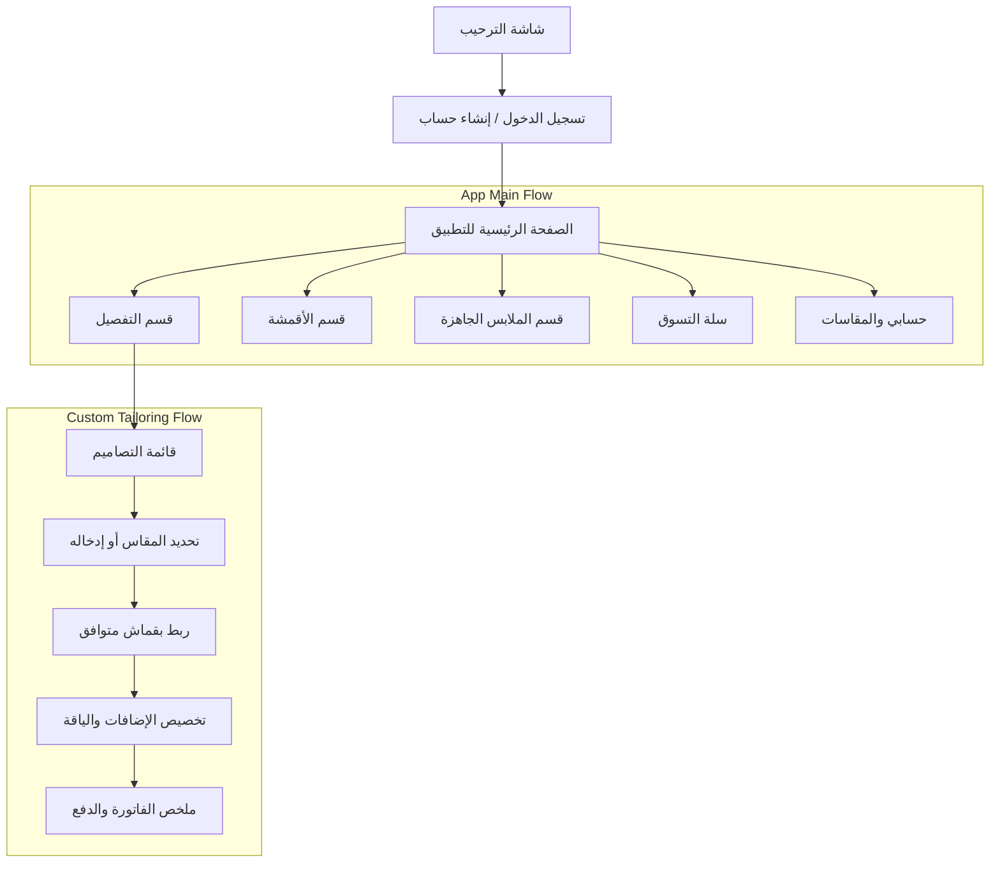

# وثيقة مواصفات وتصميم بنية النظام: منصة "موضة هندام" (Moda Hendam)
## وثيقة هندسية متكاملة لتصميم وتنفيذ المنصة

---

## مقدمة
تم إعداد هذه الوثيقة البرمجية لتكون المرجع المعماري والتنفيذي الأساسي لفريق التطوير البرمجي لبناء منصة **موضة هندام** (Moda Hendam). تعتمد المنصة على نموذج السوق البرمجي المتخصص (Vertical Marketplace) الذي يجمع بين ثلاثة قطاعات رئيسية في مجال الأزياء: تفصيل الملابس حسب الطلب، بيع الأقمشة، وبيع الملابس الجاهزة، مع دمج أنظمة إعلانات وترويج متطورة ونظام لإدارة التجار والعمليات اللوجستية والمالية.

---

## المرحلة الأولى: تحليل الأعمال (Business Analysis)

### 1. الأهداف الاستراتيجية للمنصة (Business Goals)
* **الهيمنة على قطاع الأزياء الرقمي المتخصص:** سد الفجوة بين صناعة الملابس الجاهزة وتفصيل الملابس التقليدي من خلال رقمنة عملية التفصيل بالكامل.
* **تمكين صغار التجار والمعامل:** توفير بيئة تجارية سحابية متكاملة للخياطين، تجار الأقمشة، ومصممي الأزياء لبيع خدماتهم ومنتجاتهم دون تكاليف تشغيلية مرتفعة.
* **المرونة وتجربة العميل الفائقة:** توفير واجهة مستخدم مبتكرة تمكن العميل من تفصيل ثوب أو فستان بشكل كامل مع اختيار القماش وتحديد المقاسات والدفع الرقمي في رحلة مستخدم لا تتجاوز دقائق معدودة.
* **تحقيق الربحية المستدامة:** تنويع مصادر الدخل لضمان استقرار التدفقات النقدية للمنصة.

### 2. مخطط نموذج العمل التجاري (Business Model Canvas)

| **الشركاء الرئيسيون (Key Partners)** | **الأنشطة الرئيسية (Key Activities)** | **القيمة المقترحة (Value Propositions)** | **العلاقة مع العملاء (Customer Relationships)** | **شرائح العملاء (Customer Segments)** |
| :--- | :--- | :--- | :--- | :--- |
| - تجار الأقمشة والموردين.<br>- معامل الخياطة والخياطين المستقلين.<br>- مصممو الأزياء.<br>- شركات الشحن والخدمات اللوجستية.<br>- بوابات الدفع الرقمي. | - تطوير وصيانة المنصة التقنية.<br>- التسويق الرقمي وجلب العملاء.<br>- إدارة الجودة وحل النزاعات بين التجار والعملاء.<br>- إدارة العمليات اللوجستية وتتبع الطلبات. | **للعملاء:** تفصيل مخصص وسهل، تشكيلة واسعة من الأقمشة والملابس الجاهزة، أمان مالي وتوصيل موثوق.<br>**للتجار والمعامل:** متجر إلكتروني مجاني، نظام إدارة مخزون ومبيعات، وصول لجمهور عريض، ونظام تسويق مدفوع. | - خدمة عملاء ذاتية رقمية.<br>- دعم فني مباشر عبر نظام المحادثات المدمج.<br>- برامج الولاء والمكافآت.<br>- الشفافية في التقييمات والمراجعات. | - العملاء الباحثون عن تفصيل مخصص (رجالي/نسائي).<br>- المشترون للملابس الجاهزة والإكسسوارات.<br>- المؤسسات والشركات (الزي الموحد).<br>- تجار التجزئة للأقمشة والأزياء. |
| **الموارد الرئيسية (Key Resources)** | | | **قنوات التوزيع (Channels)** | |
| - البنية التحتية السحابية (AWS).<br>- العلامة التجارية وقاعدة بيانات المستخدمين.<br>- الخوارزميات ونظام حساب المقاسات الذكي.<br>- الكوادر البرمجية والتشغيلية. | | | - موقع ويب متجاوب بالكامل (Mobile-first responsive Web App) يعمل على الهواتف والمتصفحات.<br>- لوحات التحكم الإدارية وللتجار.<br>- شبكات التواصل الاجتماعي والإعلانات. | |
| **هيكل التكاليف (Cost Structure)** | | | **مصادر الإيرادات (Revenue Streams)** | |
| - تكاليف استضافة الخوادم وصيانة البنية التحتية السحابية.<br>- رواتب الفريق التقني والإداري والدعم الفني.<br>- ميزانيات التسويق الرقمي والاستحواذ على العملاء.<br>- رسوم بوابات الدفع والعمليات البنكية. | | | - عمولة على عمليات المبيعات (تفصيل/ملابس جاهزة/أقمشة) بنسبة 10-15%.<br>- اشتراكات شهرية/سنوية للتجار للاستفادة من مميزات متقدمة.<br>- إيرادات الإعلانات الممولة للتجار والمنتجات داخل التطبيق.<br>- رسوم خدمات التوصيل والخدمات اللوجستية المضافة. | |

### 3. تحليل أصحاب المصلحة (Stakeholders Analysis)
* **العميل النهائي (Customer):** يبحث عن جودة تفصيل عالية، دقة في المقاسات، تنوع في الأقمشة، وتجربة شراء سلسة وآمنة.
* **التاجر / صاحب المتجر (Merchant):** يبحث عن أداة رقمية سهلة لإدارة المخزون، معالجة الطلبات، سحب الأرباح بسلاسة، وأدوات لزيادة المبيعات عبر الإعلانات والتخفيضات.
* **إدارة المنصة / معمل الخياطة (Admin/Tailoring Workshop):** يركز على تسيير العمليات اللوجستية، إدارة التصاميم والأجور، الرقابة المالية والأمنية، وحل النزاعات.
* **شريك التوصيل (Logistics Partner):** يحتاج إلى واجهة API واضحة لاستقبال طلبات الشحن وتحديث حالات التوصيل في الوقت الفعلي.

### 4. إستراتيجية النمو والتوسع المستقبلي (Growth & Future Expansion Strategy)
* **المدى القصير (Short-term):** إطلاق المنصة في سوق محلي محدد كفترة تجريبية (MVP) والتركيز على الأزياء الرجالية التقليدية (الأثواب) والنسائية (العبايات) لسرعة تكرار العملية والتحقق من الجدوى.
* **المدى المتوسط (Medium-term):** التوسع لجميع أقسام الأزياء الجاهزة والتفصيل المتخصص (الزي المدرسي، الجامعي، الطبي والرياضي)، وتشغيل نظام الإعلانات المدفوعة بالكامل.
* **المدى الطويل (Long-term):** دمج تقنيات الذكاء الاصطناعي لقياس المقاسات عن طريق الكاميرا (AI Body Measurement) وتقديم خدمة تجربة الملابس الافتراضية (Virtual Try-on)، والتوسع الإقليمي والدولي مع دعم اللغات والعملات المتعددة.

---

## المرحلة الثانية: تحليل المتطلبات (Requirements Analysis)

### 1. المتطلبات الوظيفية (Functional Requirements)

#### العميل (Customer)
* **الحساب والأمان:** إنشاء حساب (رقم هاتف، بريد إلكتروني، تواصل اجتماعي)، تسجيل دخول موحد، نظام التحقق بخطوتين (2FA) عبر الرسائل النصية القصيرة (SMS OTP).
* **الملف الشخصي والمقاسات:** إدارة البيانات الشخصية، وحفظ مقاسات متعددة (مقاسي، مقاس ابني، مقاس الوالد) مع تسمية كل ملف مقاسات (مثلاً: "مقاس العيد"، "مقاس العمل").
* **التصفح والبحث:** محرك بحث متقدم وذكي يدعم التصفية حسب الفئة، السعر، اللون، نوع القماش، والتقييم.
* **دورة طلبات التفصيل:** اختيار التصميم، تحديد ملف المقاسات، اختيار نوع القماش من متجر الأقمشة، إضافة ملاحظات تصميمية إضافية (أزرار، شكل الياقة، إلخ)، الدفع المبدئي لقيمة القماش، وتتبع حالة التفصيل.
* **دورة الملابس الجاهزة:** تصفح المنتجات الجاهزة، تحديد المقاس واللون, الإضافة إلى السلة، الدفع والشحن.
* **المحادثات:** نظام تواصل مباشر بالرسائل النصية والوسائط (صور، ملفات مقاسات) مرتبط بطلب محدد للتواصل مع معمل الخياطة أو التاجر.
* **المالية والتقييم:** الدفع عبر بطاقات الائتمان، مدى، Apple Pay، والتقييم بعد استلام الطلب.

#### مدير المنصة / معمل الخياطة (Admin)
* **لوحة التحكم المركزية (Global Dashboard):** لمراقبة المبيعات الإجمالية، أعداد الطلبات النشطة، وحالة النظام التشغيلية.
* **إدارة المحتوى:** إدارة تصنيفات الملابس، التصاميم المتاحة للتفصيل، وتحديد أسعار وأجور التفصيل الأساسية لكل تصميم.
* **إدارة شركاء العمل:** الموافقة على انضمام التجار (تجار أقمشة أو ملابس جاهزة)، تعليق حساباتهم، وتحديد نسب العمولات.
* **إدارة الطلبات واللوجستيات:** مراقبة وتعديل مسار طلبات التفصيل والملابس الجاهزة، إرسال التحديثات لشركات التوصيل.
* **التحكم المالي:** إدارة الفواتير، عمولات المنصة، تسوية مستحقات التجار، وإدارة الاشتراكات والتخفيضات الممولة.

#### تاجر الأقمشة (Fabric Trader)
* **إدارة كتالوج الأقمشة:** إضافة الأقمشة مع تحديد نوع القماش، الوزن، العرض، بلد المنشأ، الألوان المتاحة، والنقشات.
* **إدارة المخزون والتسعير:** تحديد الكمية المتوفرة بالمتر، سعر المتر، وحالة التوفر.
* **معالجة الطلبات:** استقبال طلب حجز قماش لعملية تفصيل، تأكيد توفر الكمية، قص القماش، وتحديث حالته إلى "تم الشحن لمعمل التفصيل".

#### تاجر الملابس الجاهزة (Ready-made Merchant)
* **إدارة المتجر الخاص:** تخصيص الهوية البصرية للمتجر داخل المنصة.
* **إدارة المنتجات المتنوعة (Configurable Products):** إضافة ملابس جاهزة مع دعم الخصائص المتعددة (ألوان متعددة، مقاسات متعددة S, M, L, XL، وجداول المقاسات الخاصة بكل منتج).
* **الأدوات التسويقية والمالية:** إنشاء أكواد الخصم الخاصة بمتجره، شراء حملات إعلانية ممولة للظهور في الصفحة الرئيسية، والاطلاع على تقارير المبيعات والأرباح القابلة للسحب.

### 2. المتطلبات غير الوظيفية (Non-Functional Requirements)
* **الأداء والاستجابة (Performance):** وقت استجابة الـ API لا يتجاوز 200ms في 95% من الطلبات. تحميل الصفحة الأولى للموقع لا يتجاوز 1.5 ثانية (LCP < 2.5s).
* **التوافرية والاعتمادية (Availability):** نسبة تشغيل خوادم المنصة لا تقل عن 99.99% (High Availability).
* **السرية والأمان (Security):** تشفير البيانات الحساسة في قاعدة البيانات (مثل كلمات المرور والمقاسات الخاصة) وتشفير حركة البيانات كاملة عبر بروتوكول HTTPS (TLS 1.3). الامتثال لمعايير PCI-DSS لعدم تخزين بيانات بطاقات الائتمان مباشرة بل معالجتها عبر Tokenization من خلال بوابة دفع معتمدة.
* **قابلية التوسع (Scalability):** القدرة على التعامل مع زيادة مفاجئة في عدد الزيارات (مثل مواسم الأعياد والعودة للمدارس) بمعدل 10 أضعاف حركة المرور الاعتيادية باستخدام التوسع التلقائي (Auto Scaling).
* **سهولة الصيانة والتطوير (Maintainability):** بنية برمجية واضحة وموثقة تعتمد على الفصل بين المهام (Separation of Concerns) مع تغطية اختبارات آلية لا تقل عن 80%.

### 3. قواعد العمل (Business Rules)
* **قاعدة دفع التفصيل ثنائي المراحل:** لا يتم البدء في خياطة الثوب/الفستان إلا بعد دفع قيمة القماش بالكامل وتأكيد وصوله للمعمل، ومن ثم دفع فاتورة أجور الخياطة الصادرة من المعمل.
* **قاعدة حجز المخزون المؤقت:** عند إضافة العميل لمنتج جاهز أو قماش إلى السلة والبدء في عملية الدفع، يتم حجز الكمية في المخزون لمدة 15 دقيقة فقط. إذا لم يتم الدفع، يتم إلغاء الحجز تلقائياً وإرجاع الكمية للمخزون.
* **قاعدة عمولة المنصة:** تقتطع المنصة تلقائياً نسبة مئوية محددة من كل عملية بيع (مثلاً 10% لتاجر الأقمشة و12% لتاجر الملابس الجاهزة) وتودع صافي المبلغ في محفظة التاجر داخل النظام كأرباح معلقة حتى انقضاء فترة الاسترجاع (14 يوماً).

### 4. الحالات الاستثنائية والخاصة (Edge Cases & Exceptional Scenarios)
* **عدم كفاية القماش للتفصيل:** يطلب العميل تفصيل تصميم معين بمقاسات كبيرة جداً، وبعد شراء القماش وإرساله للمعمل، يتبين للخياط أن كمية القماش المرسلة (مثلاً 3 أمتار) غير كافية للتصميم والمقاس المحدد.
  * **الحل النظامي:** يتيح النظام للخياط تعليق الطلب مؤقتاً وإصدار "طلب زيادة كمية القماش"، حيث يتلقى العميل إشعاراً لشراء نصف متر إضافي من نفس التاجر، أو إلغاء الطلب واسترجاع المبلغ.
* **فقدان الشحنة بين تاجر الأقمشة والمعمل:** يتم شحن القماش من التاجر إلى المعمل لكنه يتعرض للتلف أو الضياع لدى شركة التوصيل.
  * **الحل النظامي:** يتحمل التأمين اللوجستي قيمة القماش، ويقوم النظام تلقائياً بإنشاء طلب شراء جديد للقماش من التاجر الأصلي على حساب شركة الشحن وإرساله للمعمل دون إدخال العميل في النزاع لضمان تجربة مستخدم ممتازة.

---

## المرحلة الثالثة: هندسة النظام (System Architecture)

### 1. مقارنة ودراسة البنى المعمارية المقترحة

| المعمارية (Architecture) | المميزات (Pros) | العيوب (Cons) | الملاءمة للمشروع (Suitability) |
| :--- | :--- | :--- | :--- |
| **Monolith (المعماري الموحد)** | - تطوير ونشر سريع جداً.<br>- سهولة الاختبار وتتبع الأخطاء.<br>- بساطة البنية التحتية. | - صعوبة التوسع أفقياً لأجزاء محددة.<br>- تشابك الكود مع نمو المشروع.<br>- نقطة فشل واحدة للنظام بالكامل. | مناسب فقط للمرحلة الأولية جداً (MVP)، ولكنه سيعيق النمو بسرعة نظراً لتعدد موديولات المنصة. |
| **Modular Monolith (الموحد المجزأ)** | - تقسيم الكود لموديولات منفصلة منطقياً.<br>- سهولة النشر والصيانة.<br>- إمكانية التحول مستقبلاً إلى Microservices بسهولة.<br>- أداء سريع لعدم وجود اتصالات شبكية بين الموديولات. | - لا يزال يعمل على خادم وقاعدة بيانات واحدة (افتراضياً).<br>- يتطلب انضباطاً كبيراً من الفريق البرمجي لعدم خرق حدود الموديولات. | **ممتاز جداً ومناسب للمرحلة التشغيلية الأولى**؛ يجمع بين سرعة تطوير المونوليث ونظافة وبنية الميكروسيرفيسز. |
| **Clean / Hexagonal Architecture** | - فصل تام للمنطق التجاري (Domain) عن إطار العمل وقواعد البيانات.<br>- سهولة كتابة الاختبارات واختبار الموديولات بشكل منفصل. | - زيادة عدد الملفات والطبقات (Over-engineering) للمشاريع البسيطة.<br>- منحنى تعلم مرتفع للفريق. | **سنعتمدها في هيكلة كود كل موديول برمجياً** لضمان استقلالية المنطق التجاري وسهولة استبدال البنى الخارجية. |
| **Event-Driven Architecture** | - فك الارتباط التام بين العمليات والخدمات.<br>- معالجة غير متزامنة سريعة وتجربة مستخدم ممتازة. | - صعوبة تتبع مسار العمليات المعقدة.<br>- صعوبة ضمان التناسق النهائي للبيانات (Eventual Consistency). | **سنستخدمها بالتكامل مع الـ Modular Monolith** لإدارة الأحداث المشتركة (مثال: عند اكتمال الدفع، إشعار معمل التفصيل وتحديث المخزون). |
| **Microservices (الخدمات المصغرة)** | - استقلالية تامة لكل خدمة في النشر والتوسع وقاعدة البيانات والتقنيات المستخدمة. | - تعقيد هائل في البنية التحتية والـ Network Latency والتكلفة المرتفعة جداً في البداية. | غير مناسبة حالياً؛ ستؤدي إلى إهدار الموارد وتأخير إطلاق المشروع. |

### 2. القرار المعماري المبرر (Architectural Decision)
تم اختيار معمارية **Modular Monolith** مدعومة بـ **Clean Architecture** داخل الموديولات مع استخدام **Event-Driven** للاتصال بين الموديولات عبر Events داخلية (Internal Laravel Events/Queues).

#### مبررات القرار:
1. **استقلالية الموديولات:** موديول التفصيل، موديول الأقمشة، موديول المدفوعات، وموديول المحادثات معزولة تماماً برمجياً. إذا قررنا مستقبلاً تحويل موديول المحادثات إلى Microservice مستقل مبني بـ Node.js للتعامل مع الـ WebSockets بكفاءة أعلى، يمكننا اقتطاعه من المشروع خلال أيام معدودة دون التأثير على بقية النظام.
2. **قاعدة بيانات واحدة ذات تنظيم منطقي (Logical Schema Separation):** تلافي مشاكل توزيع العمليات المالية (Distributed Transactions) المعقدة جداً في الـ Microservices في بداية حياة المشروع.
3. **التكلفة التشغيلية:** يمكن تشغيل النظام بأكمله في البداية على خادمين فقط (خادم تطبيق وخادم قاعدة بيانات) مما يوفر آلاف الدولارات شهرياً للمشروع الناشئ.

### 3. المخطط المعماري للنظام (Architectural Blueprint)

```mermaid
graph TD
    User([العميل / التاجر / الأدمن]) -->|HTTPS / WSS| CDN[CDN / Cloudflare]
    CDN -->|Load Balancer| Nginx{Nginx Web Server}
    
    subgraph Modular Monolith (Laravel Application)
        Nginx -->|Route Request| AuthMod[Auth Module]
        Nginx -->|Route Request| OrderMod[Order & Tailoring Module]
        Nginx -->|Route Request| CatalogMod[Fabric & Ready-made Catalog Module]
        Nginx -->|Route Request| ChatMod[Real-time Chat Module]
        Nginx -->|Route Request| PaymentMod[Payment Module]
        Nginx -->|Route Request| PromoMod[Promo & Ads Module]
        
        %% Event Broker for Inter-module communication
        OrderMod -.->|Dispatch Event| EventBus((Laravel Event Bus))
        EventBus -.->|Trigger Listeners| CatalogMod
        EventBus -.->|Trigger Listeners| PaymentMod
        EventBus -.->|Trigger Listeners| ChatMod
    end
    
    %% External Services
    PaymentMod -->|API Tokenization| PaymentGateway[بوابة الدفع - Paylink/Mada]
    ChatMod -->|Pusher Protocol| Centrifugo[Centrifugo / Pusher WebSockets]
    AuthMod -->|SMS Gateway| SMSProvider[بوابة الرسائل SMS]
    
    %% Databases & Cache
    AuthMod & OrderMod & CatalogMod & PaymentMod & PromoMod -->|Read/Write SQL| DB[(PostgreSQL Database)]
    ChatMod -->|Fast Storage/Cache| Redis[(Redis Cache & Queue DB)]
    OrderMod -->|Push Jobs| Redis
```

---

## المرحلة الرابعة: تصميم النظام (System Design & Domain Driven Design)

### 1. سياقات الحدود (Bounded Contexts)
ينقسم النظام منطقياً إلى خمسة سياقات حدود رئيسية معزولة:
1. **Core Tailoring Context (سياق التفصيل الأساسي):** يركز على الكتالوج وتصاميم التفصيل والمقاسات ودورة حياة الخياطة.
2. **E-Commerce Context (سياق التجارة الإلكترونية):** يغطي الأقمشة والملابس الجاهزة وعربات التسوق والمخزون.
3. **Financial & Checkout Context (سياق الفوترة والمدفوعات):** يختص بإنشاء الفواتير وعمليات الدفع وتسوية حسابات التجار.
4. **Communication & Collaboration Context (سياق التواصل):** يحتوي على المحادثات الفورية والإشعارات والتنبيهات.
5. **Marketing & Advertising Context (سياق التسويق والإعلانات):** يضم التخفيضات المدفوعة والحملات الإعلانية والمساحات الإعلانية.

### 2. مصفوفة الصلاحيات والأدوار (Roles and Permissions Matrix)

| الدور (Role) | إدارة التصنيفات | إدارة الأقمشة | إدارة الملابس | إنشاء طلب تفصيل | تأكيد شحن القماش | إدارة شؤون المعمل | مراقبة النظام المالي |
| :--- | :---: | :---: | :---: | :---: | :---: | :---: | :---: |
| **Super Admin** | ✓ | ✓ | ✓ | ✗ | ✗ | ✓ | ✓ |
| **Tailor / Workshop** | ✗ | ✗ | ✗ | ✗ | ✗ | ✓ | ✗ |
| **Fabric Trader** | ✗ | ✓ (الخاصة به) | ✗ | ✗ | ✓ | ✗ | ✗ |
| **Ready-made Merchant**| ✗ | ✗ | ✓ (الخاصة به) | ✗ | ✗ | ✗ | ✗ |
| **Customer** | ✗ | ✗ | ✗ | ✓ | ✗ | ✗ | ✗ |

---

## المرحلة الخامسة: قاعدة البيانات (Database Design)

### 1. المخطط العلائقي لقاعدة البيانات (Entity Relationship Diagram - ERD)



### 2. جداول قاعدة البيانات التفصيلية (Database Schema)

#### جدول المستخدمين (`users`)
```sql
CREATE TABLE users (
    id UUID PRIMARY KEY DEFAULT gen_random_uuid(),
    name VARCHAR(255) NOT NULL,
    email VARCHAR(255) UNIQUE,
    phone VARCHAR(20) UNIQUE NOT NULL,
    password VARCHAR(255) NOT NULL,
    role VARCHAR(50) NOT NULL CHECK (role IN ('admin', 'customer', 'fabric_trader', 'merchant', 'tailor')),
    is_active BOOLEAN DEFAULT TRUE,
    created_at TIMESTAMP WITH TIME ZONE DEFAULT CURRENT_TIMESTAMP,
    updated_at TIMESTAMP WITH TIME ZONE DEFAULT CURRENT_TIMESTAMP
);
```

#### جدول المقاسات (`measurements`)
```sql
CREATE TABLE measurements (
    id UUID PRIMARY KEY DEFAULT gen_random_uuid(),
    user_id UUID NOT NULL REFERENCES users(id) ON DELETE CASCADE,
    label VARCHAR(100) NOT NULL,
    values JSONB NOT NULL, -- تخزين قيم المقاسات مثل {"chest": 105, "waist": 95, "height": 175}
    created_at TIMESTAMP WITH TIME ZONE DEFAULT CURRENT_TIMESTAMP,
    updated_at TIMESTAMP WITH TIME ZONE DEFAULT CURRENT_TIMESTAMP
);
CREATE INDEX idx_measurements_user_id ON measurements(user_id);
```

#### جدول المتاجر (`shops`)
```sql
CREATE TABLE shops (
    id UUID PRIMARY KEY DEFAULT gen_random_uuid(),
    owner_id UUID NOT NULL REFERENCES users(id) ON DELETE RESTRICT,
    name VARCHAR(255) NOT NULL,
    type VARCHAR(50) NOT NULL CHECK (type IN ('fabric', 'ready_made')),
    status VARCHAR(50) DEFAULT 'pending' CHECK (status IN ('pending', 'active', 'suspended')),
    commission_rate DECIMAL(5,2) DEFAULT 10.00,
    created_at TIMESTAMP WITH TIME ZONE DEFAULT CURRENT_TIMESTAMP,
    updated_at TIMESTAMP WITH TIME ZONE DEFAULT CURRENT_TIMESTAMP
);
CREATE INDEX idx_shops_owner_id ON shops(owner_id);
```

#### جدول الأقمشة (`fabrics`)
```sql
CREATE TABLE fabrics (
    id UUID PRIMARY KEY DEFAULT gen_random_uuid(),
    shop_id UUID NOT NULL REFERENCES shops(id) ON DELETE CASCADE,
    name VARCHAR(255) NOT NULL,
    color VARCHAR(100) NOT NULL,
    pattern VARCHAR(100),
    price_per_meter DECIMAL(10,2) NOT NULL,
    stock_meters INT NOT NULL DEFAULT 0,
    status VARCHAR(50) DEFAULT 'active' CHECK (status IN ('active', 'out_of_stock')),
    created_at TIMESTAMP WITH TIME ZONE DEFAULT CURRENT_TIMESTAMP,
    updated_at TIMESTAMP WITH TIME ZONE DEFAULT CURRENT_TIMESTAMP
);
CREATE INDEX idx_fabrics_shop_id ON fabrics(shop_id);
```

#### جدول سجلات النشاط المتقدم للمراقبة والأمان (`activity_logs`)
```sql
CREATE TABLE activity_logs (
    id UUID PRIMARY KEY DEFAULT gen_random_uuid(),
    user_id UUID REFERENCES users(id) ON DELETE SET NULL,
    action VARCHAR(255) NOT NULL,
    model_type VARCHAR(100),
    model_id UUID,
    ip_address VARCHAR(45),
    user_agent TEXT,
    payload JSONB,
    created_at TIMESTAMP WITH TIME ZONE DEFAULT CURRENT_TIMESTAMP
);
CREATE INDEX idx_activity_logs_user_id ON activity_logs(user_id);
CREATE INDEX idx_activity_logs_created_at ON activity_logs(created_at);
```

### 3. إستراتيجية الفهرسة وتقسيم البيانات (Indexing & Partitioning Strategy)
* **الفهرسة الثنائية والمشتركة (Composite Indexes):**
  * تسريع البحث في كتالوج المنتجات عبر إنشاء فهرس مشترك على الحقول الأساسية:
    `CREATE INDEX idx_fabrics_search ON fabrics(status, price_per_meter);`
* **الفهرسة النصية (Full-Text Search Indexing):**
  * استخدام ميزة `tsvector` في PostgreSQL للبحث السريع عن أسماء الأقمشة والتصاميم:
    `CREATE INDEX idx_fabrics_name_fts ON fabrics USING gin(to_tsvector('arabic', name));`
* **تقسيم جداول الرسائل والحركات المالية (Table Partitioning):**
  * جدول سجلات الأنشطة `activity_logs` وجدول الرسائل `chat_messages` قد ينموان بشكل متفجر. سيتم تقسيمهما على أساس شهري (Partitioning by Range on `created_at`) لضمان سرعة الاستعلامات التاريخية وسهولة أرشفة البيانات القديمة.

---

## المرحلة السادسة: هندسة الـ Backend (Laravel Modular Architecture)

تجنباً لتضخم المجلدات البرمجية وفقدان السيطرة عليها، سنقوم بتبني نظام الموديولات المستقلة داخل إطار العمل Laravel باستخدام هيكل محكم للمجلدات.

### 1. هيكل المجلدات المقترح للمشروع (Folder Structure)

```text
app/
├── Modules/
│   ├── Tailoring/
│   │   ├── Controllers/
│   │   │   └── TailoringOrderController.php
│   │   ├── Models/
│   │   │   ├── Design.php
│   │   │   └── Measurement.php
│   │   ├── Repositories/
│   │   │   ├── TailoringRepositoryInterface.php
│   │   │   └── TailoringRepository.php
│   │   ├── Services/
│   │   │   └── TailoringOrderService.php
│   │   ├── DTOs/
│   │   │   └── CreateTailoringOrderDTO.php
│   │   ├── Policies/
│   │   │   └── DesignPolicy.php
│   │   └── Providers/
│   │       └── TailoringServiceProvider.php
│   ├── ECommerce/
│   ├── Payment/
│   ├── Chat/
│   └── Notifications/
└── Providers/
    └── RouteServiceProvider.php
```

### 2. تطبيق الأنماط التصميمية (Design Patterns Implementation)

#### نمط الـ DTO (Data Transfer Object)
لنقل البيانات من الـ Request إلى الـ Service Layer بأمان وبشكل مكتوب ونظيف (Type-safe).

```php
namespace App\Modules\Tailoring\DTOs;

class CreateTailoringOrderDTO
{
    public function __construct(
        public readonly string $customerId,
        public readonly string $designId,
        public readonly string $fabricId,
        public readonly string $measurementId,
        public readonly array $customDetails,
        public readonly float $fabricQuantity
    ) {}

    public static function fromRequest($request): self
    {
        return new self(
            customerId: $request->user()->id,
            designId: $request->input('design_id'),
            fabricId: $request->input('fabric_id'),
            measurementId: $request->input('measurement_id'),
            customDetails: $request->input('custom_details', []),
            fabricQuantity: $request->input('fabric_quantity')
        );
    }
}
```

#### نمط الـ Service Layer
يحتوي على منطق العمل الحقيقي (Business Logic) معزولاً عن الـ HTTP Request والـ Controller.

```php
namespace App\Modules\Tailoring\Services;

use App\Modules\Tailoring\DTOs\CreateTailoringOrderDTO;
use App\Modules\Tailoring\Repositories\TailoringRepositoryInterface;
use App\Modules\ECommerce\Repositories\FabricRepositoryInterface;
use Illuminate\Support\Facades\DB;
use Exception;

class TailoringOrderService
{
    public function __construct(
        protected TailoringRepositoryInterface $tailoringRepo,
        protected FabricRepositoryInterface $fabricRepo
    ) {}

    public function initiateTailoringOrder(CreateTailoringOrderDTO $dto)
    {
        return DB::transaction(function () use ($dto) {
            // 1. التحقق من توفر مخزون القماش المطلوب وحجزه مؤقتاً
            $fabric = $this->fabricRepo->find($dto->fabricId);
            if ($fabric->stock_meters < $dto->fabricQuantity) {
                throw new Exception("كمية القماش المطلوبة غير متوفرة في المخزون حالياً.");
            }

            // 2. خصم القماش من المخزون
            $this->fabricRepo->decrementStock($dto->fabricId, $dto->fabricQuantity);

            // 3. إنشاء الطلب المبدئي للتفصيل
            $orderData = [
                'customer_id' => $dto->customerId,
                'design_id' => $dto->designId,
                'fabric_id' => $dto->fabricId,
                'measurement_id' => $dto->measurementId,
                'custom_details' => $dto->customDetails,
                'status' => 'pending_fabric_payment',
                'total_amount' => $fabric->price_per_meter * $dto->fabricQuantity
            ];

            return $this->tailoringRepo->createOrder($orderData);
        });
    }
}
```

#### الاستجابة السريعة عبر الـ Controller
يقتصر دور الـ Controller على استقبال الطلب، التحقق من الصلاحيات والمدخلات، استدعاء الـ Service، وإرجاع الاستجابة.

```php
namespace App\Modules\Tailoring\Controllers;

use App\Http\Controllers\Controller;
use App\Modules\Tailoring\Requests\CreateTailoringRequest;
use App\Modules\Tailoring\DTOs\CreateTailoringOrderDTO;
use App\Modules\Tailoring\Services\TailoringOrderService;
use Illuminate\Http\JsonResponse;

class TailoringOrderController extends Controller
{
    public function __construct(protected TailoringOrderService $orderService) {}

    public function store(CreateTailoringRequest $request): JsonResponse
    {
        $dto = CreateTailoringOrderDTO::fromRequest($request);
        
        try {
            $order = $this->orderService->initiateTailoringOrder($dto);
            return response()->json([
                'success' => true,
                'message' => 'تم إنشاء طلب التفصيل وحجز القماش بنجاح، يرجى إتمام عملية الدفع.',
                'data' => $order
            ], 201);
        } catch (\Exception $e) {
            return response()->json([
                'success' => false,
                'error' => $e->getMessage()
            ], 400);
        }
    }
}
```

### 3. إستراتيجية التخزين المؤقت (Caching Strategy)
* استخدام **Redis** لتخزين البيانات الاستعلامية غير المتغيرة باستمرار مثل: قائمة التصاميم المتاحة، كتالوج الأقمشة الأساسي، وجداول المقاسات الموحدة للتجار.
* **مثال عملي لإلغاء التخزين المؤقت (Cache Invalidation):**
  عند قيام تاجر الأقمشة بتحديث سعر القماش أو المخزون، يتم إطلاق حدث تلقائي `FabricUpdated` يقوم بمسح الـ Cache الخاص بالمنتج وإعادة توليده عند أول عملية قراءة جديدة:
  `Cache::forget("fabric_details_{$fabricId}");`

---

## المرحلة السابعة: هندسة الـ Frontend (Frontend Architecture)

### 1. بنية تدفق الشاشات (Screen Hierarchy & Navigation)



### 2. استراتيجية إدارة الحالة (State Management)
* **واجهة العميل ومتصفحات الجوال (Next.js / Responsive Web):** استخدام **Zustand** أو **Redux Toolkit** لإدارة حالة السلة والتفصيل محلياً وسهولة مزامنتها مع خادم الويب، مع استخدام **React Query** لإدارة التخزين المؤقت للبيانات القادمة من الـ API (Server State).
* **لوحات التحكم (Next.js/React):** استخدام **Zustand** لإدارة حالة الجلسة وتفضيلات لوحة التحكم بشكل خفيف وسريع.

---

## المرحلة الثامنة: هندسة تجربة المستخدم (UX Design)

لضمان تحسين معدلات التحويل (Conversion Rates) وتقليل نسبة التخلي عن السلة (Cart Abandonment) وتسهيل عملية التفصيل المعقدة، تم تصميم رحلات المستخدم بناءً على المبادئ التالية:

### 1. تبسيط عملية أخذ المقاسات (Frictionless Measurements Intake)
* بدلاً من إجبار العميل على تعبئة 15 حقلاً لقياسات معقدة في المرة الأولى، يقدم التطبيق خيارين:
  1. **القياس التقريبي السريع:** إدخال الطول والوزن الإجمالي مع خيار قياس الملابس الجاهزة المفضل (S, M, L, XL)، ليقوم النظام بتقدير المقاسات الباقية مع إتاحة خيار للتعديل من الخياط.
  2. **دليل الفيديو التفاعلي:** فيديو توضيحي مدته 45 ثانية يشرح للعميل كيفية أخذ قياساته بالمنزل خطوة بخطوة مع نموذج إدخال مبسط بالصور التوضيحية لكل منطقة قياس.

### 2. رحلة الشراء والتفصيل المدمجة (Unified Checkout Journey)
تجنباً لتشتيت العميل، يتم تجميع رحلة اختيار القماش والتفصيل والدفع في شريط تقدم علوي تفاعلي (Progress Bar) يعرض مكانه بوضوح ويمنع أي ارتباك:

```
[اختيار التصميم] ─── [تحديد المقاس] ─── [اختيار القماش] ─── [اللمسات النهائية] ─── [الدفع المبدئي]
```

---

## المرحلة التاسعة: نظام التصميم (UI Design System)

يعكس نظام التصميم البصري لمنصة "موضة هندام" شعوراً بالفخامة والحداثة، مع الحفاظ على البساطة والتركيز على صور المنتجات عالية الجودة.

### 1. نظام الألوان (Luxurious Color Palette)
* **اللون الأساسي (Primary):** الأسود الفاخر `#1A1A1A` والذهبي المطفي العتيق `#D4AF37` لإعطاء طابع الفخامة والرقي لبيوت الأزياء.
* **اللون الثانوي (Secondary):** العاجي الدافئ `#FDFBF7` والرمادي الداكن `#2D2D2D` لخلق مساحات بصرية مريحة للعين.
* **ألوان الحالات (Status Colors):**
  * النجاح (Success): `#2E7D32` (أخضر زمردي).
  * التنبيه (Warning): `#EF6C00` (برتقالي دافئ).
  * الخطأ (Danger): `#C62828` (أحمر قرمزي).

### 2. نظام الخطوط (Typography)
* **للغة العربية:** خط **Cairo** أو **Tajawal** للأزرار والنصوص الفرعية، وخط **Amiri** أو **Playfair Display** (للعناوين الكبرى لتعزيز اللمسة الجمالية الراقية للأزياء).
* **مقاييس الخطوط (Font Scaling):**
  * العناوين الكبرى: `24px / Bold`
  * العناوين الفرعية: `18px / Semi-Bold`
  * نصوص القراءة والوصف: `14px / Regular`
  * النصوص التوضيحية الصغيرة: `11px / Light`

---

## المرحلة العاشرة: هندسة الأداء (Performance Engineering)

تخفيض زمن التحميل والاستجابة لضمان رضا المستخدمين وتحسين تصنيفات محركات البحث (SEO).

### 1. معالجة وتسييل الصور (Image Optimization Pipeline)
نظراً لاعتماد المنصة على صور أقمشة وتصاميم عالية الدقة، سيتم تطبيق البنية التالية تلقائياً عند رفع أي صورة:
* تحويل جميع الصور المرفوعة إلى صيغة **WebP** الحديثة أو **AVIF** لتقليل الحجم بنسبة 70% مقارنة بـ JPEG مع الحفاظ على الجودة.
* توليد نسخ متعددة الأبعاد (Responsive Images / Thumbnails) لكل صورة تناسب قياسات الشاشات المختلفة للهواتف والأجهزة اللوحية والمكتبية.
* التخزين على خدمات التخزين السحابي (AWS S3) وتقديمها للمستخدمين عبر شبكة توصيل المحتوى **Cloudflare CDN** لتقريب البيانات جغرافياً من المستخدم.

### 2. معالجة العمليات الطويلة عبر طوابير الانتظار (Queues)
أي عملية لا تتطلب استجابة فورية للواجهات يتم إرسالها فوراً إلى طوابير الانتظار (Laravel Queues backed by Redis) مثل:
* إرسال رسائل التأكيد والبريد الإلكتروني للعملاء والتجار.
* توليد الفواتير الضريبية بصيغة PDF ورفعها سحابياً.
* دفع الإشعارات الفورية (Push Notifications) عبر خدمات Google Firebase Cloud Messaging (FCM).

---

## المرحلة الحادية عشرة: الأمن والحماية البرمجية (Cyber Security Plan)

### 1. حماية البوابة البرمجية والمدخلات
* **منع هجمات SQL Injection:** الاعتماد الكلي على الـ Query Builder و ORM (Eloquent) في Laravel اللذان يقومان بعمل حماية مدمجة (Parameterized Queries) للبيانات.
* **منع هجمات XSS (Cross-Site Scripting):** تصفية كافة مدخلات المستخدمين النصية (Sanitization) باستخدام مكتبات مخصصة مثل HTMLPurifier قبل تخزينها أو عرضها في لوحات التحكم.
* **حماية رفع الملفات (File Upload Security):**
  * التحقق الصارم من نوع الملف وحجمه (MIME Type Verification).
  * عدم السماح برفع ملفات تنفيذية إطلاقاً والتحقق من أن الصور المرفوعة حقيقية عبر قراءة أبعادها (Image Dimension Validation).
  * إعادة تسمية الملفات المرفوعة إلى أسماء عشوائية وتخزينها في خادم تخزين سحابي معزول لمنع تنفيذ أي كود خبيث داخل الخادم.

### 2. آلية التحقق والتحكم بالوصول (Authentication & Authorization)
* تطبيق بروتوكول **OAuth2** مع **JSON Web Tokens (JWT)** لعمليات الـ Mobile APIs عبر حزمة Laravel Sanctum.
* تحديد فترات صلاحية قصيرة للـ Access Token (مثلاً ساعة واحدة) مع استخدام Refresh Tokens آمنة ومخزنة في HttpOnly Cookies مشفرة للويب.
* فرض قيود صارمة على محاولات تسجيل الدخول الخاطئة (Rate Limiting) لمنع هجمات التخمين بالقوة القاهرة (Brute Force Attacks) بمعدل أقصاه 5 محاولات في الدقيقة لكل عنوان IP أو رقم هاتف.

---

## المرحلة الثانية عشرة: استراتيجية الاختبارات الجودية (Testing Strategy)

لضمان سلامة المنصة واستقرارها عند إجراء أي تعديلات برمجية مستقبلية، نتبع هرم الاختبار الموضح أدناه:

```
      / \
     /   \      E2E Tests (10%) - Cypress/Playwright
    /     \
   /-------\
  /         \   Integration / Feature Tests (30%) - PHPUnit / Pest
 /-----------\
/             \ Unit Tests (60%) - اختبار الدوال وحساب الأسعار
---------------
```

### 1. نموذج لاختبار الوحدة (Unit Test) لحساب الأسعار والخصومات
```php
namespace Tests\Unit\ECommerce;

use Tests\TestCase;
use App\Modules\ECommerce\Services\PricingService;

class PricingServiceTest extends TestCase
{
    public function test_calculate_final_price_with_valid_discount()
    {
        $pricingService = new PricingService();
        
        $basePrice = 100.00;
        $discountPercentage = 15.00; // 15% خصم
        
        $finalPrice = $pricingService->calculateFinalPrice($basePrice, $discountPercentage);
        
        $this->assertEquals(85.00, $finalPrice);
    }
}
```

---

## المرحلة الثالثة عشرة: العمليات والبنية التحتية (DevOps & CI/CD)

### 1. استراتيجية الفروع وإدارة الكود (Git Branching Strategy)
نتبع منهجية **GitFlow** المنظمة لإدارة الكود المصدر:
* `main`: فرع الكود المستقر والجاهز للإنتاج (Production). لا يتم الدمج فيه إلا بعد مراجعة دقيقة واختبار كامل.
* `develop`: فرع التطوير الأساسي وتجميع الميزات البرمجية الجديدة الجاهزة للاختبار المبدئي.
* `feature/*`: فروع فرعية تنشأ لكل ميزة برمجية جديدة على حدة، وتدمج في `develop` عبر طلب دمج (Pull Request) ومراجعة كود (Code Review) من المهندس التقني المسؤول (Tech Lead).
* `hotfix/*`: لمعالجة الأخطاء الطارئة والحرجة في الإنتاج وتدمج فوراً في `main` و `develop`.

### 2. خط أنابيب البناء والنشر التلقائي (CI/CD Pipeline)
باستخدام **GitHub Actions**:
1. **مرحلة التحقق (Lint & Test):** عند كل عملية دفع كود (Push) أو طلب دمج (PR)، يقوم النظام بتشغيل أدوات التحليل الثابت لكود PHP (PHPStan) والتحقق من التزام الكود بمعايير التنسيق (Pint)، ثم تشغيل كامل اختبارات النظام آلياً.
2. **مرحلة البناء والتهيئة (Build & Dockerize):** يتم بناء حاوية Docker للمشروع وتثبيت التبعيات الإنتاجية فقط وتوليد الأصول الثابتة.
3. **مرحلة النشر بدون توقف (Zero-Downtime Deployment):** يتم سحب الحاوية الجديدة إلى خوادم الإنتاج (على سبيل المثال باستخدام Kubernetes أو AWS ECS)، والتحقق من عمل الخوادم الجديدة بنجاح (Health Check) قبل توجيه حركة المرور إليها وإيقاف الخوادم القديمة تدريجياً.

---

## المرحلة الرابعة عشرة: خارطة الطريق والتنفيذ (Implementation Roadmap)

تم تقسيم المشروع إلى 4 مراحل زمنية رئيسية (Milestones) موزعة على مدار **16 أسبوعاً** للوصول للإنتاجية والاستقرار الكامل:

```
الأسبوع:   1   2   3   4   5   6   7   8   9  10  11  12  13  14  15  16
التحليل والتصميم ═════
تطوير البنية الأساسية  ═══════════
الكتالوج والمدفوعات         ═══════════════
نظام التفصيل الخاص                   ═══════════════
نظام المحادثات والإعلانات                      ═══════════════
الاختبار الأمني والتحميل                                 ════════════
الإطلاق المبدئي والتدشين                                          ═══
```

* **المرحلة الأولى: التأسيس والبنية التحتية (الأسابيع 1 - 4):**
  * إعداد قاعدة البيانات والـ Migrations الأساسية.
  * نظام تسجيل الدخول والمصادقة المزدوجة وإدارة الملف الشخصي للمستخدم والمقاسات.
* **المرحلة الثانية: الكتالوج الأساسي والدفع (الأسابيع 5 - 8):**
  * إدخال موديول الأقمشة والملابس الجاهزة مع المخزون والتسعير.
  * دمج سلة التسوق وبوابات الدفع الرقمية (مدى / Apple Pay).
* **المرحلة الثالثة: محرك التفصيل وخدمة المحادثات (الأسابيع 9 - 12):**
  * تفعيل موديول دورة حياة التفصيل بالكامل (ربط التصميم، المقاس، القماش، معمل الخياطة).
  * تفعيل نظام المحادثات الفورية المرتبط بالطلب ونظام رفع المرفقات والوسائط.
* **المرحلة الرابعة: التسويق، الأمان، والإطلاق (الأسابيع 13 - 16):**
  * نظام الإعلانات وحملات التخفيضات الممولة للتجار.
  * مراجعة الثغرات الأمنية واختبارات التحميل القصوى (Load Testing).
  * الإطلاق التجريبي والبدء الفعلي للعمليات التجارية.

---

## المرحلة الخامسة عشرة: مقارنة واختيار التقنيات (Technology Stack Decision)

بعد دراسة متأنية لمتطلبات المشروع وعامل الوقت وقابلية التوسع وسرعة التطوير، استقر الرأي الهندسي لفريق الاستشارات على التركيبة التقنية التالية:

### 1. الـ Backend: إطار العمل **Laravel (PHP 8.2+)**
* **لماذا Laravel؟**
  * يوفر بنية تحتية مدمجة وقوية جداً لإدارة الصلاحيات (Policies & Gates)، طوابير الانتظار (Queues)، والتخزين المؤقت (Redis integration) دون الحاجة لإعادة اختراع العجلة.
  * نظام التوثيق المتطور ومجتمع المطورين الواسع يسهلان جلب وتوظيف مبرمجين جدد للمنصة لضمان استمرارية التطوير.
  * **مقابل Django (Python):** بايثون ممتازة للذكاء الاصطناعي وعلوم البيانات ولكن إطار عمل لارافل أسرع بكثير في هيكلة الأسواق والمتاجر الإلكترونية المتشعبة والأنظمة المالية.
  * **مقابل NestJS (TypeScript):** رغم أداء NestJS العالي، إلا أن سرعة نضج وتطوير الكود في لارافل لمهام الأسواق الإلكترونية تتجاوز NestJS بمعدل 40% على الأقل مما يوفر وقتاً ثميناً للشركة.

### 2. الـ Frontend: إطار عمل **Next.js (React)** للموقع المتجاوب (Responsive Web) ولوحات التحكم
* **لماذا Next.js للويب والجوال مبدئياً؟**
  * **توفير الوقت والجهد:** بدلاً من تطوير تطبيق جوال مستقل (Flutter) وتكبد عناء رفعه على المتاجر وموافقات Apple وGoogle في المرحلة التجريبية، يتم بناء موقع ويب واحد متجاوب بالكامل (Mobile-first Responsive Web App) يعمل بكفاءة تامة على متصفحات الجوال.
  * **تحسين محركات البحث (SEO):** دعم كامل لأرشفة المنتجات والتصاميم والأقمشة في محركات البحث لجلب الزوار العضويين (Organic Traffic)، وهو ما لا يمكن تحقيقه بسهولة عبر تطبيقات الجوال المغلقة.
  * **تحديث فوري وسلس:** إمكانية إصلاح الأخطاء وتحديث الواجهات وتجربة المستخدم فوراً على خادم الويب دون الحاجة لانتظار تحميل العميل لتحديثات التطبيق.

### 3. قاعدة البيانات: **PostgreSQL**
* **لماذا PostgreSQL؟**
  * دعم ممتاز وحقيقي لنوع البيانات **JSONB** مما يتيح لنا تخزين وحساب المقاسات وخصائص المنتجات الجاهزة المرنة (الألوان والمقاسات والتفضيلات) بسرعة وسلاسة كبيرة تشابه قواعد NoSQL ولكن مع الاحتفاظ بالصلابة والترابط المالي (ACID Compliance) لقواعد البيانات العلائقية.

---

## المرحلة السادسة عشرة: تحليل المخاطر والحد منها (Risks & Mitigation)

| تصنيف الخطر | الخطر المتوقع (Risk) | خطة الاحتواء والحد من الأثر (Mitigation Plan) |
| :--- | :--- | :--- |
| **تقني (Technical)** | فقدان مزامنة المخزون وتجاوز البيع (Over-selling) عند الطلب الكثيف المتزامن على قماش محدد. | استخدام قفل قاعدة البيانات المتفائل (Pessimistic Locking / `SELECT FOR UPDATE`) عند معالجة طلب الدفع لضمان عدم حجز نفس القماش لعميلين في نفس اللحظة. |
| **تشغيلي (Operational)** | تقاعس معامل الخياطة عن تحديث حالات الطلبات مما يؤدي إلى غضب العملاء. | تفعيل نظام للتنبيهات الآلية المتصاعدة وإشعار مدير النظام عند تأخر أي طلب تفصيل في حالة معينة لأكثر من 48 ساعة دون إجراء من المعمل. |
| **تجاري (Business)** | قلة استخدام ميزة الإعلانات الممولة من التجار الجدد لعدم ثقتهم في البداية. | تقديم رصيد إعلاني مجاني ترحيبي للتجار الجدد عند تفعيل حساباتهم لتجربة الأداة ورؤية النتائج الفعلية على مبيعاتهم. |

---
> [!IMPORTANT]
> يوصى فريق الهندسة التقنية بالبدء فوراً في إعداد البيئة الافتراضية للمطورين (Local Dev Environment) وبناء نماذج قاعدة البيانات والموديولات البرمجية للمرحلة الأولى وفقاً لهيكل المجلدات الموضح في المرحلة السادسة.
